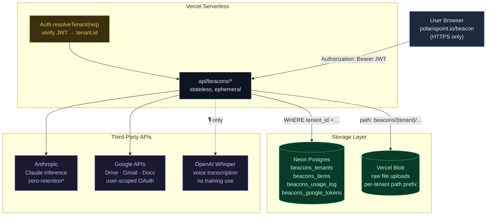
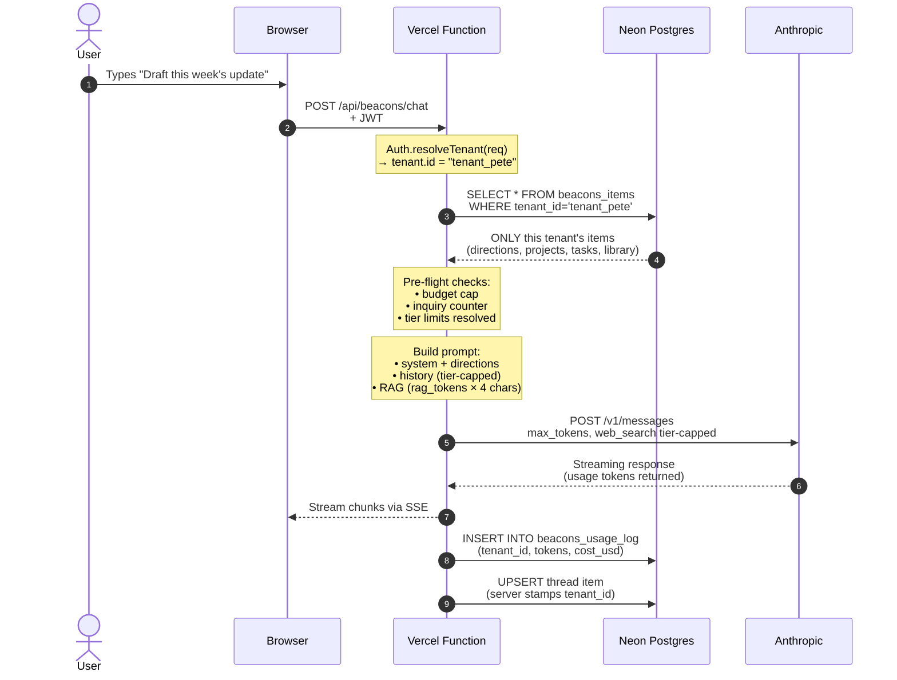
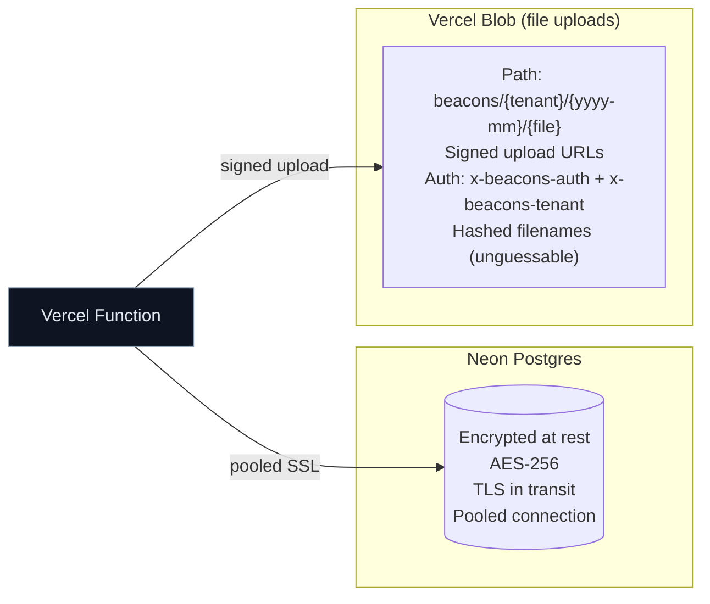
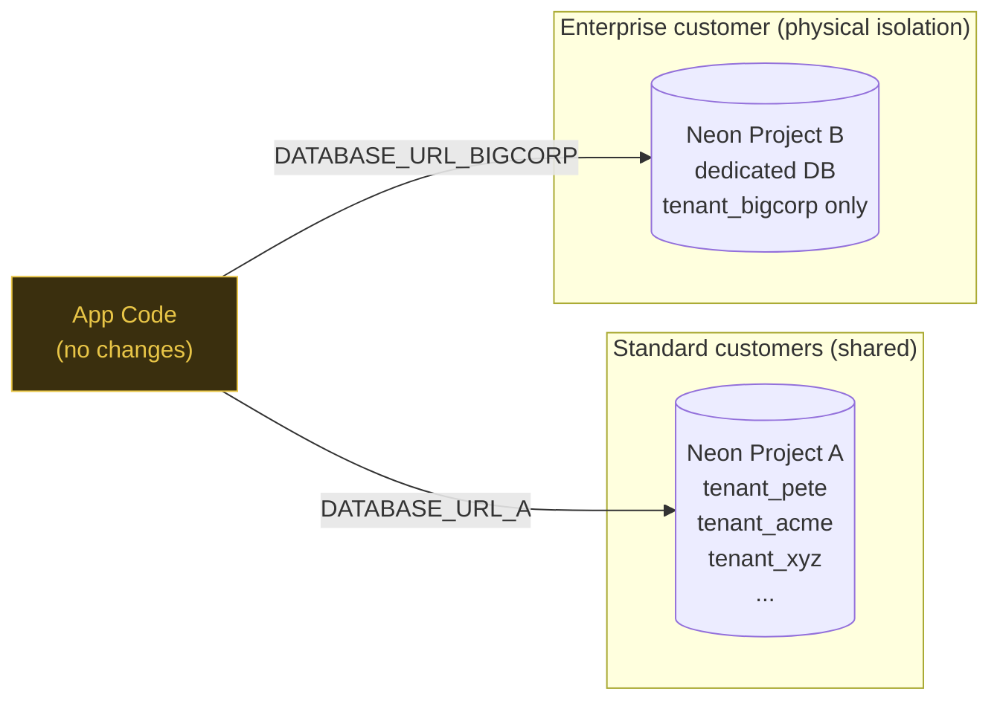

# Beacon — User Data Flow & Security

How a user's data moves through Beacon, where it lives, and how tenant isolation prevents cross-customer leaks.

> Diagrams render as SVG on GitHub. In VSCode, open with Markdown Preview (`Cmd+Shift+V`); the **Markdown Preview Mermaid Support** extension renders them inline.

---

## 1. Top-level data flow



\* Anthropic's standard API retains transient logs ~30 days for abuse review; zero-retention available on enterprise agreement.

---

## 2. Per-chat trace

The path of a single chat request, showing where tenant isolation kicks in.



---

## 3. Storage isolation (logical multi-tenancy)

Single shared Postgres instance, but every query is scoped by `tenant_id`. The server stamps tenant_id from the verified JWT — clients can never spoof it.

```mermaid
flowchart TB
    Query["App Query<br/>WHERE tenant_id = 'tenant_pete'"]:::query

    subgraph Neon["Neon Postgres (shared instance, encrypted at rest)"]
        direction LR
        subgraph T1["tenant_pete"]
            T1S["items: 247<br/>threads: 38<br/>files: 12"]
        end
        subgraph T2["tenant_acme"]
            T2S["items: 12<br/>threads: 2<br/>files: 4"]
        end
        subgraph T3["tenant_xyz"]
            T3S["items: 891<br/>threads: 156<br/>files: 23"]
        end
    end

    Query ==scopes to==> T1
    Query x-.x cannot see .-x T2
    Query x-.x cannot see .-x T3

    classDef query fill:#3a2f0e,stroke:#e8c547,color:#e8c547,stroke-width:2px
```

**Enforcement layers** (all in code, see [api/beacons/items.js](polaris-point-demos/api/beacons/items.js)):

1. JWT verified before any DB touch — invalid token = 401
2. Reads: every `SELECT` includes `WHERE tenant_id = ${resolvedTenantId}`
3. Writes: before UPDATE, server confirms existing row's `tenant_id` matches caller's
4. No client-supplied tenant_id is trusted — the field is overwritten server-side
5. NULL tenant_id rejected as "unclaimed" — old rows can't be hijacked

---

## 4. Tenant isolation in tables

| Table | tenant_id source | Index |
|---|---|---|
| `beacons_tenants` | own `id` column (PK) | PK + email |
| `beacons_items` | server-stamped from JWT | (tenant_id, updated_at DESC) |
| `beacons_usage_log` | server-stamped from JWT | (tenant_id, created_at DESC) |
| `beacons_google_tokens` | server-stamped from JWT | (tenant_id) UNIQUE |

---

## 5. Storage at rest — encryption & access



DB credentials live as Vercel **Sensitive** env vars — they don't appear in `vercel env pull` output, only in the runtime function process. No DB credentials in the repo.

---

## 6. Third-party data sharing

| Third party | What they see | Retention | Reason |
|---|---|---|---|
| **Anthropic** | Chat context (system + history + message) per call | Zero-retention on enterprise; standard API: transient logs ~30d for abuse review | LLM inference |
| **OpenAI (Whisper)** | Audio bytes when 🎙 Record is used | Not used for training; short-term logs | Voice → text fallback when browser dictation fails |
| **Google (Drive/Gmail/Docs)** | Only what user explicitly attaches/exports | Stored in user's own Drive (their account) | User-opted I/O |
| **Vercel** | Function metadata + DB connection traffic | ~30 days logs | Hosting + observability |
| **Stripe** (when billing enabled) | Customer email, plan, payment method | Per Stripe retention | Billing |

No customer content goes to analytics tools, error reporters, or training pipelines.

---

## 7. Data deletion & portability

- **Delete one item** → `DELETE /api/beacons/items?id=…` removes the row (tenant-scoped) and the Blob if it's a file
- **Delete whole tenant** → admin op: `DELETE FROM beacons_items WHERE tenant_id='…'` + same for `beacons_usage_log` + revoke Google tokens
- **Export** → `GET /api/beacons/items` returns all of a tenant's items as JSON (full library + threads in one dump)

---

## 8. Containerized / physical-isolation upgrade path

The current model is **logical multi-tenancy on a shared Postgres**. For customers requiring **physical isolation** (enterprise, regulated industries, sovereignty), the same codebase supports per-customer Neon projects:



Same app code path; only the connection string changes per request based on tenant tier. A `tier='enterprise'` customer maps to a dedicated DB connection. No fork of the application.

---

## 9. What's NOT here (intentionally)

- **Background workers** — none. All Beacon logic runs in request-scoped Vercel functions. No async daemons holding tenant data outside a request.
- **Caching layer** — Anthropic's ephemeral prompt cache (1h TTL) is scoped to a content hash unique per tenant. No cross-tenant cache hits.
- **CDN** — Static assets (HTML/JS/CSS) are CDN-cached. User data never is.

---

*Generated: 2026-05-15. Update when tenant isolation, third-party integrations, or storage topology changes.*
