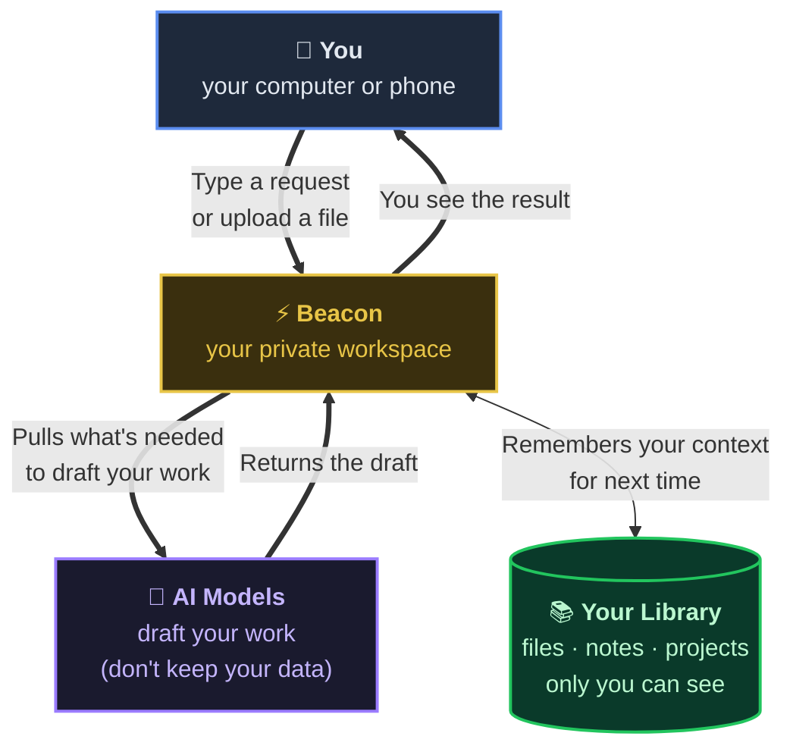

# How Your Work Stays Private in Beacon

A simple look at where your data goes and how we keep it yours.

---

## The flow

---

## What this means in plain English

### ✅ Your data stays yours
Only you can see your files, projects, and chats. Other Beacon users — including big enterprise customers — cannot see your stuff. Ever.

### ✅ AI doesn't keep your data
Beacon uses Claude (by Anthropic) to draft your work. Anthropic doesn't train their AI on what you send through their business API. Your work isn't fueling anyone else's model.

### ✅ You decide what's connected
Google Drive and Gmail only sync what you tell Beacon to read. We don't poke around in folders you haven't shared.

### ✅ You can delete anything, anytime
One click removes a file, a project, or your whole account. When you delete, it's gone — not archived.

---

## Where your stuff lives

| What | Where | Who can see it |
|---|---|---|
| Your typed text, projects, tasks | Encrypted database | Only you |
| Files you upload (PDFs, decks, docs) | Encrypted file storage | Only you |
| Your conversations with Beacon | Saved so you can find past drafts | Only you |
| Voice notes you record | Transcribed by OpenAI, then stored as a note | Only you |

All of it is **encrypted** — both while moving across the internet and while sitting in storage.

---

## What Beacon never does

❌ Sell your data
❌ Train AI on your work
❌ Share with other Beacon users
❌ Use your data for ads, analytics, or anything else

---

## How we know you're really you

Every time you open Beacon, we check your sign-in. The data Beacon shows you is **locked to your account** — even if someone got into our database somehow, they'd see locked rows tied to accounts they can't sign in as.

---

## Need the deep-dive?

For your IT team, compliance review, or security questionnaires, the full technical version with diagrams of how isolation is enforced in code lives in [data-flow-security.md](data-flow-security.md).

---

*Last updated: May 2026.*
